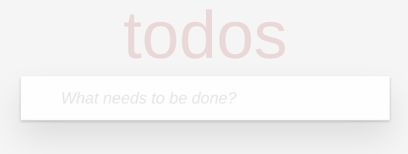
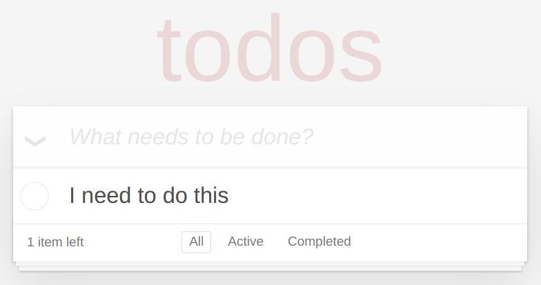
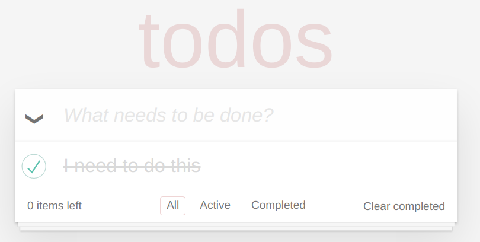
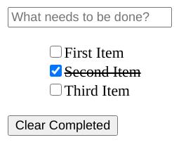
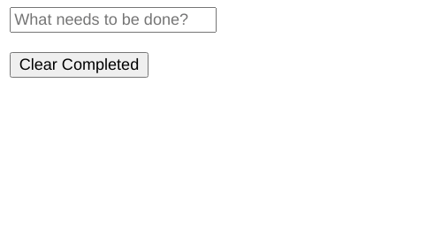

# JavaScript Takehome

Hi prospective Matrix AI UI/UX Architect!

Here is your assignment.

This is a Todo List application.

You must create 1 `todo.html` file that uses vanilla HTML and vanilla JavaScript to replicate the above UI.

You do not need style the UI, no CSS is required unless you want to make it look pretty.

The end result should look like this:

The interface must have these features:

* The ability to create new todo items with a string description.
* The ability to tick items as completed with the description striked out.
* The ability to click a button that clears completed items.

Here's an animation of the UI working.

Remember please use only vanilla HTML and vanilla JS. The HTML file should be executable on the Chrome Browser.

The entire task can be completed in less than 60 lines of code.
